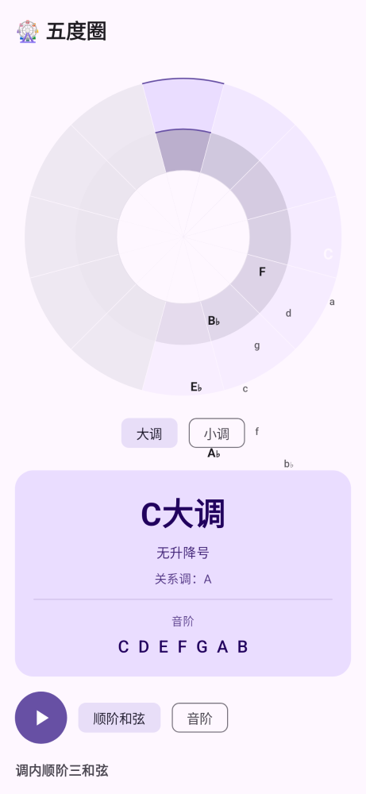
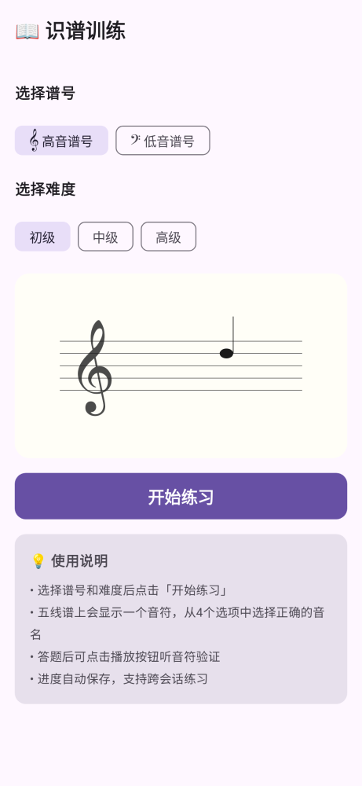
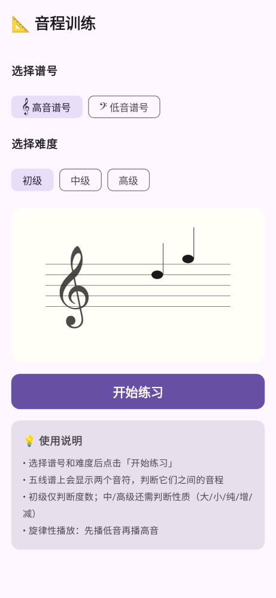

# 🎹 Piano Companion

> Android App: AI-powered piano score following with automatic page turning and real-time error detection.
> 
> 钢琴智能翻页与弹奏纠错应用

[](https://opensource.org/licenses/MIT)
[](https://developer.android.com)
[](https://kotlinlang.org)

## ✨ Features

### Core Features (MVP)
- 📖 **Auto Page Turning** — Listens to your playing and automatically scrolls/turns sheet music pages
- ❌ **Real-time Error Detection** — Identifies wrong notes as you play and highlights them
- 📂 **Score Library** — Import and manage MusicXML/MIDI sheet music files
- 🔇 **Fully Offline** — All processing runs locally on your device, no internet required

### Music Theory Tools
- 🎹 **Sight Reading** — Deterministic melody generator for unlimited practice material
- 👂 **Ear Training** — Interval / chord / scale identification with synthesized piano tones
- 🥁 **Rhythm Training** — Listen to a rhythm, tap it back, get scored
- 🎵 **Chord Dictionary** — 18 chord types × 12 roots × 4 inversions with audio
- 🎶 **Scale Library** — 17 scale types × 12 roots with fingering suggestions
- 🎼 **Chord Progressions** — 14 common progressions (pop / jazz / blues / canon) with Roman-numeral analysis
- 🎡 **Circle of Fifths** — Interactive key wheel with diatonic chords and closely-related keys
- 📚 **Cadence Library** — 6 cadence types × 12 keys with voice-leading playback
- 📖 **Note Reading Trainer** — Sight-read single notes on the staff (treble/bass, 3 difficulty levels)
- 📐 **Interval Trainer** — Identify intervals visually from two notes on the staff

### Planned Features
- 📸 **OMR Recognition** — Photograph sheet music and auto-convert to digital format
- 📊 **Practice Statistics** — Track accuracy, error patterns, and progress over time
- 🎵 **Built-in Metronome** — Synced with auto page turning
- 🐌 **Slow Practice Mode** — Reduced tempo following for practice sessions

## 📸 Screenshots

> Rendered headlessly via [Paparazzi](https://github.com/cashapp/paparazzi) (no device/emulator required).

<p align="center">
  
  
  
  
</p>

## 🏗️ Architecture

```
┌──────────────────────────────────────────────┐
│           UI Layer (Jetpack Compose)           │
│   Library │ Practice │ Settings                │
├──────────────────────────────────────────────┤
│         Business Logic Layer (Kotlin)          │
│  Score Engine │ Audio Engine │ Following Engine│
├──────────────────────────────────────────────┤
│           Audio Processing Layer               │
│  Pitch Detection (YIN) │ Online DTW │ Onset   │
└──────────────────────────────────────────────┘
```

### Core Algorithms
- **YIN Pitch Detection** — Fundamental frequency estimation for piano notes
- **Online Dynamic Time Warping (DTW)** — Real-time alignment of detected notes with score
- **Spectral Flux Onset Detection** — Note onset detection from audio energy changes

## 🔧 Tech Stack

| Component | Technology |
|-----------|-----------|
| Language | Kotlin 2.0 |
| UI Framework | Jetpack Compose + Material 3 |
| Audio Capture | Android AudioRecord (44.1kHz/16bit) |
| Pitch Detection | Custom YIN implementation |
| Score Following | Online DTW algorithm |
| Score Format | MusicXML 3.0+ / MIDI |
| Min SDK | Android 8.0 (API 26) |

## 📂 Project Structure

```
PianoCompanion/
├── app/
│   └── src/main/java/com/pianocompanion/
│       ├── data/
│       │   ├── model/          # Data models (Note, Score, PracticeSession)
│       │   ├── parser/         # MusicXML parser
│       │   └── repository/     # Score file management
│       ├── audio/
│       │   ├── AudioRecorder.kt     # Microphone capture
│       │   ├── PitchDetector.kt     # YIN pitch detection
│       │   └── NoteDetector.kt      # Note onset + segmentation
│       ├── following/
│       │   ├── OnlineDTW.kt         # DTW score following
│       │   └── ScoreFollower.kt     # High-level following coordinator
│       ├── ui/
│       │   ├── theme/          # Material 3 theme
│       │   ├── navigation/     # Nav graph
│       │   ├── library/        # Score library screen
│       │   ├── practice/       # Practice mode screen
│       │   └── settings/       # Settings screen
│       ├── util/
│       │   └── MusicUtils.kt   # Music theory utilities
│       ├── MainActivity.kt
│       └── PianoCompanionApp.kt
├── docs/
│   └── PRD.md                  # Product Requirements Document
└── app/src/test/               # Unit tests
```

## 🚀 Development Roadmap

| Phase | Features | Status |
|-------|----------|--------|
| Phase 1 | Project setup + Score import/render | ✅ Done |
| Phase 2 | Audio capture + Pitch detection | ✅ Done |
| Phase 3 | Score following (DTW) + Auto page turn | ✅ Done |
| Phase 4 | Error detection + UI polish | ✅ Done |
| Phase 5 | OMR recognition + Practice stats | 🚧 Planned |

## 📦 Building

> **Note:** This project requires Android Studio to build and run.

1. Clone the repository
2. Open in Android Studio (Hedgehog or later)
3. Sync Gradle and build
4. Run on a device or emulator (API 26+)

## 🧪 Testing

The project has **2500+ unit tests** (100% passing), covering:

- `MusicUtils` — MIDI/frequency conversions, note name parsing
- `PitchDetector` — YIN algorithm accuracy with synthesized sine waves
- `OnlineDTW` — Score following with correct, wrong, and extra notes
- **OMR engine** — Staff detection, noteheads, rhythm analysis, rests, key/time signatures, deskew, denoise, keystone correction (250+ tests)
- **Music theory** — Chord/Scale/Progression/Cadence engines, Circle of Fifths, KeyDetector, Transposer
- **Training modules** — Ear/Rhythm/Note-reading/Interval trainers (deterministic seeds, session state machines, progress persistence)
- **Audio builders** — PCM rendering (PianoToneSynthesizer), buffer lengths, no-clipping, determinism

**Screenshot tests** (via [Paparazzi](https://github.com/cashapp/paparazzi)) render key Compose screens headlessly to PNG — no device or emulator required. See the `📸 Screenshots` section above. Run with `gradle :app:testDebugUnitTest` and view the report at `app/build/reports/paparazzi/debug/`.

## 📝 License

MIT License — see [LICENSE](LICENSE)

## 🙏 Acknowledgments

- [piano-auto-page-turner](https://github.com/gentlehus/piano-auto-page-turner) — DTW score following inspiration
- [Audiveris](https://github.com/Audiveris/audiveris) — OMR engine reference
- [online_amt](https://github.com/jdasam/online_amt) — Real-time piano transcription reference
- [MidiSheetMusic-Android](https://github.com/ditek/MidiSheetMusic-Android) — Android sheet music UI reference
- YIN algorithm: de Cheveigné & Kawahara (2002)
